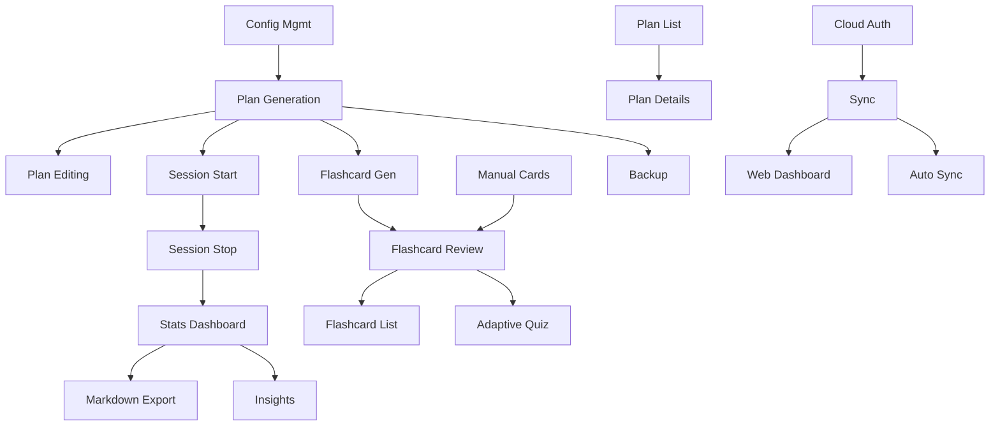

# Functional Requirements

## MVP Scope (Phase 1)

### Must Have

#### FR-001: Plan Generation
- **Description**: User can generate learning plans via LLM
- **Acceptance Criteria**:
  - User runs `samedi init <topic>` with optional hours parameter
  - System calls configured LLM CLI with plan generation template
  - LLM output is validated for required structure
  - Plan saved as markdown in `~/.samedi/plans/`
  - Plan metadata indexed in SQLite
  - User can specify LLM model via flag or config
- **Priority**: P0 (Blocker)

#### FR-002: Manual Plan Editing
- **Description**: User can edit plans directly in their preferred editor
- **Acceptance Criteria**:
  - User runs `samedi plan edit <plan-id>`
  - Plan opens in $EDITOR
  - On save, system validates markdown structure
  - SQLite metadata automatically updated
  - Warns if format errors detected
- **Priority**: P0 (Blocker)

#### FR-003: Session Start
- **Description**: User can start timed learning sessions
- **Acceptance Criteria**:
  - User runs `samedi start <plan-id> [chunk-id]`
  - System checks for existing active session, errors if found
  - New session created with start timestamp
  - Displays chunk objectives if chunk-id provided
  - Returns immediately (non-blocking)
- **Priority**: P0 (Blocker)

#### FR-004: Session Stop
- **Description**: User can stop active sessions and record notes
- **Acceptance Criteria**:
  - User runs `samedi stop`
  - System finds active session, calculates duration
  - Prompts for optional notes and artifacts
  - Updates session record with end time and metadata
  - Shows session summary
- **Priority**: P0 (Blocker)

#### FR-005: Session Status
- **Description**: User can check active session status
- **Acceptance Criteria**:
  - User runs `samedi status`
  - Displays active session info (plan, chunk, elapsed time)
  - Shows recent sessions if no active session
  - Suggests next action
- **Priority**: P0 (Blocker)

#### FR-006: Flashcard Generation
- **Description**: LLM can extract flashcards from plan content
- **Acceptance Criteria**:
  - User runs `samedi cards generate <plan-id> [chunk-id]`
  - System extracts chunk content from markdown
  - Calls LLM with flashcard extraction template
  - Parses Q&A pairs from LLM output
  - User previews and approves cards
  - Cards saved to markdown and SQLite
- **Priority**: P0 (Blocker)

#### FR-007: Manual Flashcard Creation
- **Description**: User can manually add flashcards
- **Acceptance Criteria**:
  - User runs `samedi cards add <plan-id>`
  - Interactive prompts for question, answer, tags
  - Card saved with default SM-2 values
  - Associated with plan and optional chunk
- **Priority**: P0 (Blocker)

#### FR-008: Flashcard Review
- **Description**: User can review flashcards with spaced repetition
- **Acceptance Criteria**:
  - User runs `samedi review [plan-id]`
  - Queries cards due today (next_review <= today)
  - Launches TUI review interface
  - User rates each card (1-4 scale)
  - SM-2 algorithm updates ease factor and interval
  - Results saved to markdown and SQLite
  - Shows review summary
- **Priority**: P0 (Blocker)

#### FR-009: Plan List
- **Description**: User can view all learning plans
- **Acceptance Criteria**:
  - User runs `samedi plan list`
  - Displays table with ID, title, status, progress, hours
  - Supports filtering by status, tag
  - Supports sorting by various fields
  - Can output as JSON for scripting
- **Priority**: P0 (Blocker)

#### FR-010: Plan Details
- **Description**: User can view detailed plan information
- **Acceptance Criteria**:
  - User runs `samedi plan show <plan-id>`
  - Displays plan metadata and progress
  - Shows recent chunks with status indicators
  - Lists session history and flashcard count
  - Suggests next action (start next chunk)
- **Priority**: P0 (Blocker)

#### FR-011: Basic Stats Dashboard
- **Description**: User can view learning statistics in TUI
- **Acceptance Criteria**:
  - User runs `samedi stats [plan-id]`
  - TUI shows total hours, active plans, streak
  - Displays progress bars for each plan
  - Shows recent session history
  - Updates in real-time (refreshable)
- **Priority**: P0 (Blocker)

#### FR-012: Configuration Management
- **Description**: User can configure samedi behavior
- **Acceptance Criteria**:
  - User runs `samedi config list|get|set|edit`
  - Can change LLM provider, model, timeout
  - Can customize TUI theme, date format
  - Can edit config file directly in $EDITOR
  - Invalid config values rejected with clear errors
- **Priority**: P0 (Blocker)

#### FR-013: Local Backup
- **Description**: User can backup all learning data
- **Acceptance Criteria**:
  - User runs `samedi backup`
  - Creates .tar.gz of plans/, cards/, sessions.db, config
  - Saved to ~/samedi-backups/ with timestamp
  - Shows backup size and contents summary
  - Can specify custom output path
- **Priority**: P0 (Blocker)

#### FR-014: Data Validation
- **Description**: System validates data integrity
- **Acceptance Criteria**:
  - User runs `samedi check`
  - Validates SQLite foreign keys and constraints
  - Checks markdown frontmatter completeness
  - Verifies file references exist
  - Reports errors with actionable fixes
  - `--fix` flag auto-repairs if possible
- **Priority**: P1 (High)

#### FR-015: Markdown Export
- **Description**: User can export stats and reports
- **Acceptance Criteria**:
  - User runs `samedi report markdown`
  - Generates comprehensive learning report
  - Includes summary, plan details, session logs
  - Outputs to stdout (pipeable)
  - Can filter by plan or date range
- **Priority**: P1 (High)

### Should Have

#### FR-016: TUI Main Dashboard
- **Description**: User can launch interactive dashboard
- **Acceptance Criteria**:
  - User runs `samedi` (no args)
  - Shows main menu with quick actions
  - Displays streak, recent activity
  - Keyboard navigation (j/k, enter, q)
  - Can start sessions, review cards from menu
- **Priority**: P1 (High)

#### FR-017: Flashcard List
- **Description**: User can view all flashcards
- **Acceptance Criteria**:
  - User runs `samedi cards list [plan-id]`
  - Shows table with plan, total, due, new counts
  - Can filter by due date, plan, tag
  - Summary statistics at bottom
- **Priority**: P1 (High)

#### FR-018: Plan Archiving
- **Description**: User can archive completed/abandoned plans
- **Acceptance Criteria**:
  - User runs `samedi plan archive <plan-id>`
  - Confirmation prompt for destructive action
  - Plan status set to 'archived'
  - Excluded from default list views
  - Can be restored with `unarchive` command
- **Priority**: P2 (Medium)

#### FR-019: Shell Completions
- **Description**: Bash/Zsh/Fish completions for commands
- **Acceptance Criteria**:
  - User runs `samedi completion bash|zsh|fish`
  - Generates completion script
  - Completes commands, subcommands, flags
  - Completes plan IDs dynamically
- **Priority**: P2 (Medium)

#### FR-020: JSON Output Mode
- **Description**: All commands support JSON output
- **Acceptance Criteria**:
  - All list/show commands accept `--json` flag
  - Output valid, parseable JSON
  - Enables scripting and automation
  - Documented schema for each command
- **Priority**: P2 (Medium)

### Could Have

#### FR-021: Quick Aliases
- **Description**: Short command aliases
- **Acceptance Criteria**:
  - `samedi s` → `samedi start`
  - `samedi r` → `samedi review`
  - `samedi st` → `samedi stats`
  - Configurable custom aliases
- **Priority**: P3 (Low)

#### FR-022: Custom Templates
- **Description**: User can create custom LLM prompts
- **Acceptance Criteria**:
  - User edits templates in `~/.samedi/templates/`
  - Can specify template per command with `--template`
  - Validates template variables on use
- **Priority**: P3 (Low)

#### FR-023: Plan Import
- **Description**: Import externally created plans
- **Acceptance Criteria**:
  - User runs `samedi import plan < plan.md`
  - Validates format, imports if valid
  - Useful for manual LLM interaction
- **Priority**: P3 (Low)

## Phase 2: Cloud Sync

### Must Have

#### FR-024: Cloudflare Authentication
- **Description**: User authenticates for cloud sync
- **Acceptance Criteria**:
  - Email-based auth via magic link
  - Username mapped to email
  - Auth token stored securely
  - `samedi login` and `samedi logout` commands

#### FR-025: Two-Way Sync
- **Description**: Sync data with Cloudflare
- **Acceptance Criteria**:
  - `samedi sync` uploads and downloads changes
  - Last-write-wins conflict resolution
  - Handles network failures gracefully
  - Shows sync progress and errors

#### FR-026: Web Dashboard
- **Description**: View stats on web (mobile-friendly)
- **Acceptance Criteria**:
  - Read-only web interface
  - Displays stats, plans, recent activity
  - Responsive design for mobile
  - No editing (terminal-only for inputs)

### Should Have

#### FR-027: Periodic Auto-Sync
- **Description**: Automatic background sync
- **Acceptance Criteria**:
  - Configurable interval (default: 30min)
  - Non-blocking, silent on success
  - Notifies on conflicts or errors
  - Can disable in config

#### FR-028: Sync Status
- **Description**: Check sync state
- **Acceptance Criteria**:
  - `samedi sync status` shows last sync time
  - Indicates pending changes
  - Shows sync conflicts if any

## Phase 3: Intelligence

### Must Have

#### FR-029: Adaptive Quizzing
- **Description**: LLM-generated quizzes based on progress
- **Acceptance Criteria**:
  - `samedi quiz <plan-id>` launches quiz
  - LLM generates questions from weak areas
  - Interactive TUI quiz interface
  - Results influence next chunk recommendations

#### FR-030: Learning Insights
- **Description**: LLM analyzes learning patterns
- **Acceptance Criteria**:
  - `samedi insights` generates report
  - Identifies strengths, weaknesses
  - Suggests curriculum adjustments
  - Compares pace to plan timeline

### Should Have

#### FR-031: iCal Export
- **Description**: Export sessions to calendar
- **Acceptance Criteria**:
  - `samedi export ical` generates .ics file
  - Each session becomes calendar event
  - Can filter by date range, plan
  - Import to Google Calendar, Outlook, etc.

#### FR-032: Anki Integration
- **Description**: Import/export Anki flashcards
- **Acceptance Criteria**:
  - `samedi export anki` creates Anki deck
  - `samedi import anki` reads Anki format
  - Preserves SM-2 scheduling data
  - Maps tags and metadata

## Non-Functional Requirements

### Performance

#### NFR-001: Response Time
- All CLI commands return < 1 second (excluding LLM calls)
- TUI renders < 100ms
- Database queries < 50ms

#### NFR-002: LLM Timeout
- Configurable timeout (default: 120s)
- Retries on transient failures (max 2)
- Graceful degradation on LLM unavailable

#### NFR-003: Data Size
- Support 1000+ plans per user
- Support 50,000+ flashcards
- SQLite file < 100MB for typical usage

### Reliability

#### NFR-004: Data Integrity
- All database writes are transactional
- Corrupt data detected and reported
- Automatic backups on plan generation

#### NFR-005: Crash Recovery
- Active sessions recoverable after crash
- No data loss on force quit
- Orphaned data cleaned up automatically

### Usability

#### NFR-006: Error Messages
- Clear, actionable error messages
- Suggest fixes, not just report errors
- Link to docs/help for complex issues

#### NFR-007: Documentation
- Man pages for all commands
- `--help` on every command/subcommand
- Example usage in help text

### Security

#### NFR-008: Local Data Security
- Files readable only by owner (chmod 600)
- No sensitive data in logs
- LLM API keys never logged

#### NFR-009: Cloud Data Security (Phase 2)
- TLS for all API calls
- Auth tokens expire after 30 days
- User can delete all cloud data

### Compatibility

#### NFR-010: Platform Support
- macOS (primary)
- Linux (Ubuntu, Arch, Fedora)
- Windows WSL2 (best effort)

#### NFR-011: Terminal Support
- Works in standard terminals (Terminal.app, iTerm2)
- Works over SSH
- Works in tmux/screen
- Graceful degradation on limited terminals

#### NFR-012: LLM CLI Support
- Claude Code (tier 1)
- Codex, llm, gemini, Amazon Q (tier 1)
- Custom CLIs via config (tier 2)

## Feature Dependencies

## Validation Strategy

### Acceptance Testing

- Each FR has automated test
- Test with real LLM CLI (integration tests)
- Test with mock LLM (unit tests)

### User Testing

- Dogfood: Developers use samedi to learn
- Beta testers from target audience
- Collect feedback on FR priority

### Edge Cases

- Empty plans
- Extremely long sessions (>8 hours)
- Concurrent samedi instances (same data dir)
- Disk full scenarios
- Network failures (Phase 2)

## Success Metrics

### MVP Success (Phase 1)
- [ ] 100% of P0 FRs implemented
- [ ] 80% of P1 FRs implemented
- [ ] All NFRs met for supported platforms
- [ ] 5 beta users complete 1 plan each

### Phase 2 Success
- [ ] Cloud sync works reliably (99.9% uptime)
- [ ] Web dashboard accessible from mobile
- [ ] Users track learning on 2+ devices

### Phase 3 Success
- [ ] Adaptive quizzing shows measurable retention improvement
- [ ] 50% of users export to calendar/Anki
