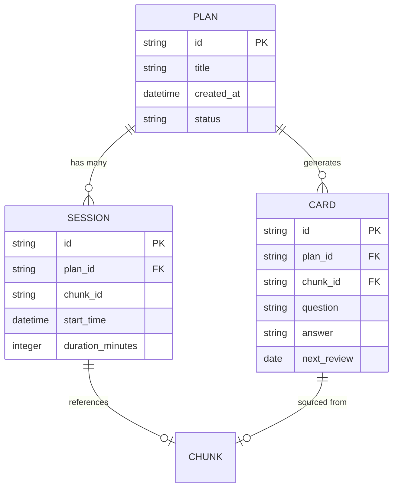

# Data Model

## Storage Strategy

**Hybrid Approach**: Human-readable for plans, queryable for sessions.

```
~/.samedi/
├── config.toml                    # User configuration
├── plans/                         # Learning curricula (markdown)
│   ├── french-b1.md
│   ├── rust-async.md
│   └── music-theory-basics.md
├── cards/                         # Flashcards (markdown)
│   ├── french-b1.cards.md
│   └── rust-async.cards.md
├── sessions.db                    # SQLite for time tracking & stats
└── templates/                     # LLM prompt templates
    ├── plan-generation.md
    ├── flashcard-extraction.md
    └── quiz-generation.md
```

### Why Hybrid?

| Data Type | Format | Reason |
|-----------|--------|--------|
| Plans | Markdown | User-editable, git-trackable, portable |
| Flashcards | Markdown | Import/export to Anki, readable without tools |
| Sessions | SQLite | Fast queries for stats, aggregations, filtering |
| Config | TOML | Human-friendly, comments, type-safe parsing |

## Core Entities

### 1. Learning Plan

**Purpose**: LLM-generated curriculum broken into time-boxed chunks.

**Storage**: `~/.samedi/plans/{plan-id}.md`

**Schema** (Markdown with structured frontmatter):

```markdown
---
id: french-b1
title: French B1 Mastery
created: 2024-01-15T10:00:00Z
updated: 2024-01-20T15:30:00Z
total_hours: 50
status: in-progress
tags: [language, french, b1]
---

# French B1 Mastery

**Goal**: Achieve B1 level proficiency in French
**Timeline**: 50 hours over 10 weeks
**Completion**: 12/50 chunks (24%)

## Chunk 1: Basic Greetings {#chunk-001}
**Duration**: 1 hour
**Status**: completed
**Objectives**:
- Master 20 common greetings and responses
- Understand tu vs. vous
- Proper pronunciation of liaisons

**Resources**:
- [Duolingo: Basics 1-3]
- [French Pod 101: Episode 1-5]

**Deliverable**: Record 2-minute self-introduction

---

## Chunk 2: Present Tense Verbs {#chunk-002}
**Duration**: 1.5 hours
**Status**: in-progress
**Objectives**:
- Conjugate -er, -ir, -re verbs
- 15 most common irregular verbs
- Construct simple sentences

**Resources**:
- [Lawless French: Present Tense]
- [Practice repo: github.com/user/french-practice]

**Deliverable**: 50 sentence exercises

---

## Chunk 3: ... {#chunk-003}
...
```

**Parsing Rules**:
- `---` frontmatter for metadata
- `## Chunk N: Title {#chunk-id}` for sections
- `**Field**: value` for chunk metadata
- Status values: `not-started`, `in-progress`, `completed`, `skipped`

### 2. Session

**Purpose**: Actual time spent learning, linked to plan chunks.

**Storage**: SQLite table

**Schema**:

```sql
CREATE TABLE sessions (
    id TEXT PRIMARY KEY,              -- UUID
    plan_id TEXT NOT NULL,             -- References plan file
    chunk_id TEXT,                     -- Optional chunk reference
    start_time DATETIME NOT NULL,      -- ISO 8601
    end_time DATETIME,                 -- NULL if in progress
    duration_minutes INTEGER,          -- Calculated on stop
    notes TEXT,                        -- User notes after session
    artifacts TEXT,                    -- JSON array of URLs/paths
    cards_created INTEGER DEFAULT 0,   -- Number of flashcards added
    created_at DATETIME DEFAULT CURRENT_TIMESTAMP,

    FOREIGN KEY (plan_id) REFERENCES plans(id)
);

CREATE INDEX idx_sessions_plan ON sessions(plan_id);
CREATE INDEX idx_sessions_start ON sessions(start_time);
CREATE INDEX idx_sessions_chunk ON sessions(chunk_id);
```

**Example**:
```json
{
  "id": "550e8400-e29b-41d4-a716-446655440000",
  "plan_id": "french-b1",
  "chunk_id": "chunk-001",
  "start_time": "2024-01-15T10:00:00Z",
  "end_time": "2024-01-15T11:00:00Z",
  "duration_minutes": 60,
  "notes": "Struggled with pronunciation, need more practice",
  "artifacts": ["github.com/user/french-practice", "recording.mp3"],
  "cards_created": 5
}
```

### 3. Plan Metadata (SQLite)

**Purpose**: Queryable plan info without parsing markdown.

**Schema**:

```sql
CREATE TABLE plans (
    id TEXT PRIMARY KEY,              -- Slug from filename
    title TEXT NOT NULL,
    created_at DATETIME NOT NULL,
    updated_at DATETIME NOT NULL,
    total_hours REAL,                 -- Estimated total
    status TEXT NOT NULL,             -- not-started, in-progress, completed, archived
    tags TEXT,                        -- JSON array
    file_path TEXT NOT NULL,          -- Absolute path to .md file

    UNIQUE(file_path)
);

CREATE INDEX idx_plans_status ON plans(status);
CREATE INDEX idx_plans_created ON plans(created_at);
```

**Sync Strategy**:
- Update SQLite when plan markdown is modified
- Use file mtime to detect out-of-sync
- `samedi sync` command to reconcile

### 4. Flashcard

**Purpose**: Spaced repetition cards extracted from learning.

**Storage**: `~/.samedi/cards/{plan-id}.cards.md`

**Schema** (Markdown):

```markdown
# French B1 Flashcards

## Card 1 {#card-001}
**Q**: How do you say "Good morning" formally in French?
**A**: Bonjour

**Tags**: greeting, formal
**Source**: Chunk 1
**Created**: 2024-01-15
**Ease**: 2.5
**Interval**: 3
**Next Review**: 2024-01-18

---

## Card 2 {#card-002}
**Q**: Conjugate "parler" (to speak) in present tense - je, tu, il
**A**: je parle, tu parles, il parle

**Tags**: verb, present, -er
**Source**: Chunk 2
**Created**: 2024-01-16
**Ease**: 2.5
**Interval**: 1
**Next Review**: 2024-01-17

---
```

**Also tracked in SQLite for scheduling**:

```sql
CREATE TABLE cards (
    id TEXT PRIMARY KEY,
    plan_id TEXT NOT NULL,
    chunk_id TEXT,                    -- Source chunk
    question TEXT NOT NULL,
    answer TEXT NOT NULL,
    tags TEXT,                        -- JSON array
    created_at DATETIME NOT NULL,

    -- Spaced repetition (SM-2 algorithm)
    ease_factor REAL DEFAULT 2.5,
    interval_days INTEGER DEFAULT 1,
    repetitions INTEGER DEFAULT 0,
    next_review DATE NOT NULL,
    last_review DATE,

    FOREIGN KEY (plan_id) REFERENCES plans(id)
);

CREATE INDEX idx_cards_review ON cards(next_review);
CREATE INDEX idx_cards_plan ON cards(plan_id);
```

### 5. Configuration

**Purpose**: User preferences and LLM CLI settings.

**Storage**: `~/.samedi/config.toml`

**Schema**:

```toml
[user]
email = "user@example.com"          # For cloud sync (optional)
username = "johndoe"                 # Display name
timezone = "America/Los_Angeles"

[llm]
provider = "claude"                  # claude, codex, gemini, amazonq, custom
cli_command = "claude"               # Executable name
default_model = "claude-sonnet-4"
timeout_seconds = 120

# For custom providers
# [llm.custom]
# command = "llm"
# args = ["--model", "gpt-4"]

[storage]
data_dir = "~/.samedi"
backup_enabled = true
backup_dir = "~/samedi-backups"
auto_backup_days = 7

[sync]
enabled = false                      # Phase 2
cloudflare_endpoint = ""
sync_interval_minutes = 30

[tui]
theme = "dracula"                    # dracula, monokai, gruvbox
date_format = "2006-01-02"
time_format = "15:04"
first_day_of_week = "monday"

[learning]
default_chunk_minutes = 60
reminder_enabled = true
reminder_message = "What did you learn today?"
streak_tracking = true
```

## Relationships



## Data Operations

### Create Plan
1. User: `samedi init <topic>`
2. Samedi calls LLM CLI with template
3. LLM outputs markdown plan
4. Save to `~/.samedi/plans/{topic-slug}.md`
5. Parse frontmatter → insert into `plans` table
6. Generate flashcards → save to `cards/` + `cards` table

### Start Session
1. User: `samedi start <plan-id> [chunk-id]`
2. Check for active session → error if exists
3. Insert into `sessions` with `start_time`, `end_time=NULL`
4. Return session ID for reference

### Stop Session
1. User: `samedi stop`
2. Find active session (end_time IS NULL)
3. Update `end_time = NOW()`
4. Calculate `duration_minutes`
5. Prompt for notes and artifacts
6. Update session record

### Review Flashcards
1. Query `cards` WHERE `next_review <= TODAY` ORDER BY `next_review`
2. Show in TUI quiz interface
3. User rates difficulty (again=1, hard=2, good=3, easy=4)
4. Update SM-2 values: ease_factor, interval, next_review
5. Save back to markdown + SQLite

### View Stats
1. Query aggregations from `sessions`:
   - SUM(duration_minutes) GROUP BY plan_id
   - COUNT(*) sessions per day (streak)
   - AVG(duration_minutes) per session
2. Query `plans` for completion rates
3. Query `cards` for review counts
4. Render in TUI with charts

## Backup & Export

### Local Backup
```bash
samedi backup
# Creates: ~/samedi-backups/samedi-2024-01-15.tar.gz
# Contains: plans/, cards/, sessions.db, config.toml
```

### Export Formats

**Markdown Report**:
```bash
samedi export markdown --plan french-b1 > report.md
# Generates: plan overview + session logs + stats
```

**iCal Events** (Phase 2):
```bash
samedi export ical --since 2024-01-01 > learning.ics
# Creates calendar events for each session
```

**Anki Cards**:
```bash
samedi export anki --plan french-b1 > french.txt
# Anki-compatible tab-separated format
```

## Migration Strategy

### V1 → V2 (Adding Fields)
```sql
-- Add new column with default
ALTER TABLE sessions ADD COLUMN mood TEXT DEFAULT 'neutral';
```

### Plan Markdown Format Changes
- Keep old format parseable (backward compat)
- Add `version` to frontmatter
- Migrate command: `samedi migrate plans --to v2`

## Data Integrity

### Constraints
- Plan ID must match filename slug
- Session must reference existing plan
- Session end_time > start_time
- Card next_review >= today

### Validation
- `samedi check` command validates:
  - SQLite foreign keys
  - Markdown frontmatter completeness
  - File references exist
  - Date/time logic

### Conflict Resolution (Phase 2)
- Last-write-wins for session data
- Merge strategies for plan edits
- User prompt for card conflicts
