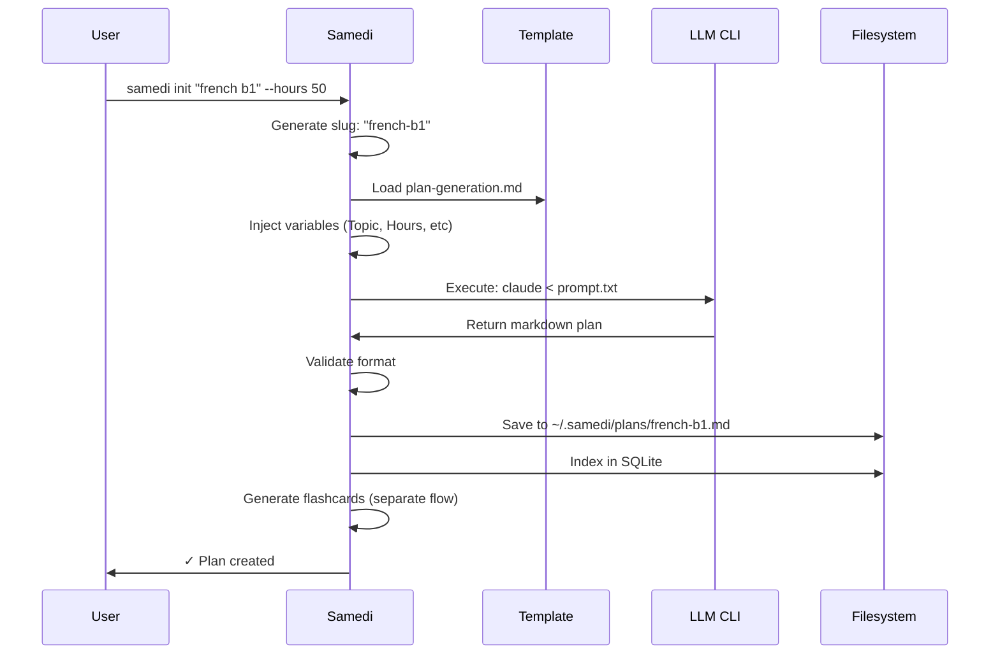
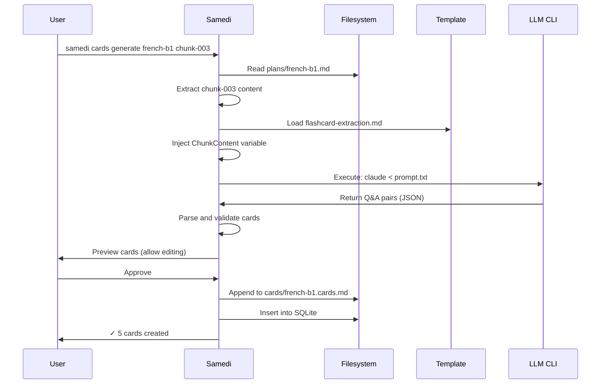

# LLM Integration

## Philosophy

**Samedi doesn't teach. LLMs do.**

Samedi is the orchestrator:
- Provides structured prompts
- Captures LLM outputs
- Validates and stores results
- Tracks progress

LLMs are the tutors:
- Design curricula
- Extract flashcards
- Generate quizzes
- Provide insights

## Supported LLM CLIs

### Tier 1: Built-in Support

| CLI | Command | Notes |
|-----|---------|-------|
| Claude Code | `claude` | Primary, recommended |
| Codex | `codex` | OpenAI's CLI |
| llm (Simon Willison) | `llm` | Multi-provider wrapper |
| Gemini CLI | `gemini` | Google's CLI |
| Amazon Q | `q` | AWS CLI |

### Tier 2: Custom

Any CLI that:
1. Accepts prompt via stdin or file
2. Outputs text to stdout
3. Returns exit code 0 on success

**Example custom config**:
```toml
[llm.custom]
command = "ollama"
args = ["run", "llama2", "--prompt-from-stdin"]
```

## Configuration

### User Config (~/.samedi/config.toml)

```toml
[llm]
provider = "claude"                  # claude | codex | gemini | amazonq | custom
cli_command = "claude"               # Executable name/path
default_model = "claude-sonnet-4"    # Model identifier
timeout_seconds = 120                # Max execution time
max_retries = 2                      # Retry on failure

# Provider-specific settings
[llm.claude]
model = "claude-sonnet-4"
temperature = 0.7

[llm.codex]
model = "gpt-4"
api_key_env = "OPENAI_API_KEY"       # Environment variable name

[llm.gemini]
model = "gemini-pro"

[llm.custom]
command = "/usr/local/bin/my-llm"
args = ["--mode", "curriculum"]
stdin = true                         # Pass prompt via stdin
```

## Prompt Templates

### Template Storage

```
~/.samedi/templates/
├── plan-generation.md               # Curriculum design
├── flashcard-extraction.md          # Extract Q&A from content
├── quiz-generation.md               # Adaptive quizzing (Phase 2)
└── insights.md                      # Learning insights (Phase 2)
```

### Template Format

**Markdown with variables**:

```markdown
# Plan Generation Template

You are an expert curriculum designer. Create a comprehensive learning plan.

## Topic
{{.Topic}}

## Parameters
- Total Hours: {{.TotalHours}}
- Learning Level: {{.Level}}
- Goals: {{.Goals}}

## Requirements
- Break into {{.TotalHours}}-hour chunks of 30-60 minutes each
- Each chunk must have:
  - Clear objectives (3-5 bullet points)
  - Recommended resources
  - Deliverable/outcome
- Output in this EXACT markdown format:

---
id: {{.Slug}}
title: {{.Topic}}
created: {{.Now}}
total_hours: {{.TotalHours}}
status: not-started
tags: []
---

# {{.Topic}}

**Goal**: [Main learning goal]
**Timeline**: {{.TotalHours}} hours over [X weeks]

## Chunk 1: [Title] {#chunk-001}
**Duration**: [X hours]
**Status**: not-started
**Objectives**:
- [Objective 1]
- [Objective 2]

**Resources**:
- [Resource 1]

**Deliverable**: [What to produce]

---

[Continue for all chunks...]
```

### Template Variables

| Variable | Type | Example |
|----------|------|---------|
| `{{.Topic}}` | string | "French B1 Mastery" |
| `{{.Slug}}` | string | "french-b1" |
| `{{.TotalHours}}` | int | 50 |
| `{{.Level}}` | string | "beginner" |
| `{{.Goals}}` | string | "Conversation fluency" |
| `{{.Now}}` | timestamp | "2024-01-15T10:00:00Z" |
| `{{.ChunkContent}}` | string | (For flashcard extraction) |

## Integration Flows

### 1. Plan Generation

**User Command**:
```bash
samedi init "french b1" --hours 50
```

**Flow**:



**Implementation (Go)**:

```go
func (s *Samedi) GeneratePlan(topic string, hours int) error {
    // 1. Load template
    tmpl, err := s.loadTemplate("plan-generation.md")
    if err != nil {
        return err
    }

    // 2. Prepare variables
    vars := map[string]interface{}{
        "Topic":      topic,
        "Slug":       slug.Make(topic),
        "TotalHours": hours,
        "Level":      "intermediate", // From user prompt or config
        "Goals":      "", // From user input
        "Now":        time.Now().Format(time.RFC3339),
    }

    // 3. Render template
    prompt, err := tmpl.Execute(vars)
    if err != nil {
        return err
    }

    // 4. Call LLM
    output, err := s.llm.Call(prompt)
    if err != nil {
        return fmt.Errorf("LLM error: %w", err)
    }

    // 5. Validate output
    plan, err := s.validatePlan(output)
    if err != nil {
        return fmt.Errorf("invalid plan format: %w", err)
    }

    // 6. Save
    path := filepath.Join(s.dataDir, "plans", slug+".md")
    if err := os.WriteFile(path, []byte(output), 0644); err != nil {
        return err
    }

    // 7. Index
    if err := s.db.IndexPlan(plan); err != nil {
        return err
    }

    return nil
}
```

### 2. Flashcard Extraction

**User Command**:
```bash
samedi cards generate french-b1 chunk-003
```

**Flow**:



**Flashcard Extraction Template**:

```markdown
# Flashcard Extraction

Extract flashcards from this learning content.

## Content
{{.ChunkContent}}

## Instructions
- Create 5-10 high-quality flashcards
- Focus on key concepts, not trivial facts
- Use clear, concise language
- Output as JSON array

## Output Format (JSON)
[
  {
    "question": "What is X?",
    "answer": "X is Y",
    "tags": ["concept", "definition"]
  },
  ...
]
```

**Output Parsing**:

```go
type FlashcardOutput struct {
    Question string   `json:"question"`
    Answer   string   `json:"answer"`
    Tags     []string `json:"tags"`
}

func (s *Samedi) ExtractFlashcards(planID, chunkID string) ([]Flashcard, error) {
    // 1. Get chunk content
    content, err := s.getChunkContent(planID, chunkID)
    if err != nil {
        return nil, err
    }

    // 2. Call LLM
    tmpl, _ := s.loadTemplate("flashcard-extraction.md")
    prompt, _ := tmpl.Execute(map[string]interface{}{
        "ChunkContent": content,
    })
    output, err := s.llm.Call(prompt)
    if err != nil {
        return nil, err
    }

    // 3. Parse JSON
    var cards []FlashcardOutput
    if err := json.Unmarshal([]byte(output), &cards); err != nil {
        // Fallback: try to extract JSON from markdown code block
        output = extractCodeBlock(output, "json")
        if err := json.Unmarshal([]byte(output), &cards); err != nil {
            return nil, err
        }
    }

    // 4. Convert to internal format
    result := make([]Flashcard, len(cards))
    for i, c := range cards {
        result[i] = Flashcard{
            ID:       uuid.New().String(),
            PlanID:   planID,
            ChunkID:  chunkID,
            Question: c.Question,
            Answer:   c.Answer,
            Tags:     c.Tags,
            Created:  time.Now(),
        }
    }

    return result, nil
}
```

### 3. LLM CLI Execution

**Abstract Interface**:

```go
type LLMProvider interface {
    Call(prompt string) (string, error)
    Stream(prompt string) (<-chan string, error) // Phase 2
}

type ClaudeProvider struct {
    command string
    model   string
    timeout time.Duration
}

func (c *ClaudeProvider) Call(prompt string) (string, error) {
    ctx, cancel := context.WithTimeout(context.Background(), c.timeout)
    defer cancel()

    // Write prompt to temp file
    tmpfile, err := os.CreateTemp("", "samedi-prompt-*.txt")
    if err != nil {
        return "", err
    }
    defer os.Remove(tmpfile.Name())

    if _, err := tmpfile.Write([]byte(prompt)); err != nil {
        return "", err
    }
    tmpfile.Close()

    // Execute CLI
    cmd := exec.CommandContext(ctx, c.command,
        "--prompt-file", tmpfile.Name(),
        "--model", c.model,
    )

    output, err := cmd.CombinedOutput()
    if err != nil {
        return "", fmt.Errorf("claude CLI error: %w\n%s", err, output)
    }

    return string(output), nil
}
```

**Provider-Specific Implementations**:

```go
// Claude Code
type ClaudeProvider struct { ... }
func (c *ClaudeProvider) Call(prompt string) (string, error) {
    // claude --prompt "..." --model "..."
}

// Codex (OpenAI)
type CodexProvider struct { ... }
func (c *CodexProvider) Call(prompt string) (string, error) {
    // codex --prompt "..." --model "gpt-4"
}

// llm (Simon Willison)
type LLMProvider struct { ... }
func (l *LLMProvider) Call(prompt string) (string, error) {
    // llm "..." -m claude-3-opus
}

// Custom
type CustomProvider struct {
    command string
    args    []string
    useStdin bool
}
func (c *CustomProvider) Call(prompt string) (string, error) {
    if c.useStdin {
        // echo "..." | custom-cli
    } else {
        // custom-cli --prompt "..."
    }
}
```

## Error Handling

### LLM Failures

**Scenarios**:
1. CLI not found
2. Timeout
3. Invalid output format
4. Rate limiting (API errors)

**Handling**:

```go
func (s *Samedi) callLLMWithRetry(prompt string) (string, error) {
    var lastErr error
    for attempt := 0; attempt <= s.config.LLM.MaxRetries; attempt++ {
        output, err := s.llm.Call(prompt)
        if err == nil {
            return output, nil
        }

        lastErr = err

        // Check if retryable
        if errors.Is(err, context.DeadlineExceeded) {
            fmt.Fprintf(os.Stderr, "Timeout, retrying (%d/%d)...\n",
                attempt+1, s.config.LLM.MaxRetries)
            time.Sleep(time.Second * time.Duration(attempt+1))
            continue
        }

        // CLI not found, auth errors - don't retry
        if isNonRetryable(err) {
            return "", err
        }
    }

    return "", fmt.Errorf("failed after %d retries: %w",
        s.config.LLM.MaxRetries, lastErr)
}
```

### Format Validation

**Plan Validation**:

```go
func (s *Samedi) validatePlan(markdown string) (*Plan, error) {
    // 1. Parse frontmatter
    fm, content, err := parseFrontmatter(markdown)
    if err != nil {
        return nil, fmt.Errorf("invalid frontmatter: %w", err)
    }

    // 2. Check required fields
    required := []string{"id", "title", "total_hours"}
    for _, field := range required {
        if _, ok := fm[field]; !ok {
            return nil, fmt.Errorf("missing required field: %s", field)
        }
    }

    // 3. Parse chunks
    chunks := parseChunks(content)
    if len(chunks) == 0 {
        return nil, errors.New("no chunks found")
    }

    // 4. Validate chunk format
    for i, chunk := range chunks {
        if chunk.ID == "" {
            return nil, fmt.Errorf("chunk %d: missing {#chunk-id}", i+1)
        }
        if chunk.Duration == 0 {
            return nil, fmt.Errorf("chunk %d: missing **Duration**", i+1)
        }
    }

    return &Plan{
        ID:         fm["id"].(string),
        Title:      fm["title"].(string),
        TotalHours: fm["total_hours"].(float64),
        Chunks:     chunks,
    }, nil
}
```

**User Feedback on Errors**:

```
✗ Plan generation failed: Invalid output format

The LLM did not follow the required format.
Expected frontmatter with fields: id, title, total_hours

Retry with: samedi init "french b1" --retry
Edit template: samedi config edit templates/plan-generation.md
```

## Prompt Engineering

### Best Practices

1. **Be Specific**: Exact output format, not "generate a plan"
2. **Provide Examples**: Show 1-2 complete chunk examples
3. **Constrain Output**: JSON schemas, regex patterns
4. **Iterate**: Test with multiple LLMs, refine prompts

### Template Versioning

```
~/.samedi/templates/
├── plan-generation.md           # Latest
├── plan-generation.v1.md        # Backup
└── plan-generation.v2.md        # Experimental
```

**Config override**:
```toml
[templates]
plan_generation = "plan-generation.v2.md"  # Test new version
```

## LLM Interaction Modes

### Mode 1: Samedi Calls LLM (Current)

User runs samedi command → Samedi calls LLM CLI → Result processed

**Pros**: Fully automated, consistent
**Cons**: Limited user control, no interactive refinement

### Mode 2: User Calls LLM Directly (Phase 2)

User in Claude/Codex chat → Generates plan → `samedi import plan < plan.md`

**Pros**: User can iterate with LLM, full context
**Cons**: Manual import step

**Implementation**:
```bash
# In Claude Code chat
User: "Create a 50-hour French B1 curriculum with 60min chunks"
Claude: [Generates markdown plan]

# Copy output, import
samedi import plan --from clipboard
# Or
pbpaste | samedi import plan --stdin
```

### Mode 3: Hybrid (Future)

Samedi launches LLM chat, monitors output, auto-imports when ready

## Testing LLM Integration

### Mock LLM for Tests

```go
type MockLLM struct {
    responses map[string]string
}

func (m *MockLLM) Call(prompt string) (string, error) {
    // Return canned responses
    if strings.Contains(prompt, "french") {
        return m.responses["french_plan"], nil
    }
    return "", errors.New("unknown prompt")
}

// Test
func TestGeneratePlan(t *testing.T) {
    mock := &MockLLM{
        responses: map[string]string{
            "french_plan": validPlanMarkdown,
        },
    }

    s := NewSamedi(WithLLM(mock))
    plan, err := s.GeneratePlan("french b1", 50)
    assert.NoError(t, err)
    assert.Equal(t, "french-b1", plan.ID)
}
```

### Golden Files

Store known-good LLM outputs for regression testing:

```
tests/
├── fixtures/
│   ├── plan-french-b1.golden.md
│   ├── cards-rust-async.golden.json
│   └── quiz-music-theory.golden.md
└── llm_test.go
```

## Future Enhancements (Phase 2+)

### Streaming Output

```go
func (s *Samedi) GeneratePlanStreaming(topic string) error {
    stream, err := s.llm.Stream(prompt)
    if err != nil {
        return err
    }

    for chunk := range stream {
        fmt.Print(chunk) // Live display
    }
}
```

### Context Passing

Pass previous session notes to LLM for adaptive curricula:

```markdown
## Previous Sessions
{{.SessionNotes}}

## Adjust the next chunk based on:
- User struggled with: {{.Difficulties}}
- User excelled at: {{.Strengths}}
```

### Multi-LLM Consensus

Use multiple LLMs, merge outputs for higher quality:

```go
func (s *Samedi) GeneratePlanWithConsensus(topic string) (*Plan, error) {
    plans := []Plan{}

    for _, provider := range []LLMProvider{claude, codex, gemini} {
        plan, _ := provider.GeneratePlan(topic)
        plans = append(plans, plan)
    }

    // Merge: take common chunks, vote on objectives
    return mergePlans(plans), nil
}
```
